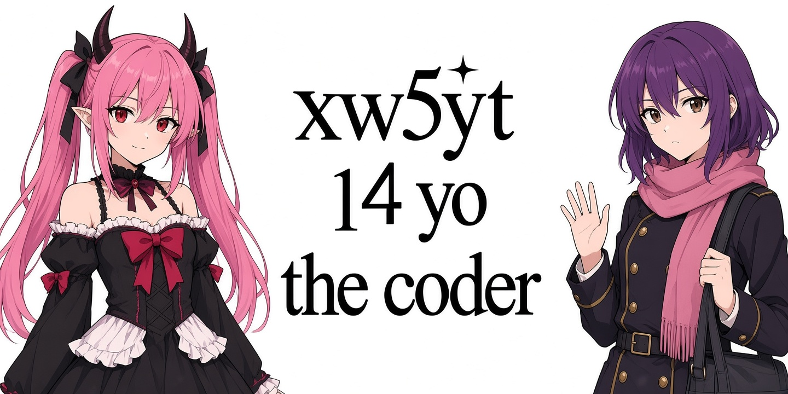

  

<h1 align="center">xw5yt // vibe-coder</h1>

  <i>"не зря мы сис админы"</i>

  

---

### // about
я — **xw5yt**, 14-летний девелопер, который топит за «вайб-кодинг». моя стихия — Windows 10, виртуалки и бесконечные эксперименты с тем, как заставить системы работать на грани возможного. не просто пишу код, а создаю экосистемы: от управления локальными LLM через Ollama до автоматизации визуальных конвейеров на ComfyUI. 

я здесь, чтобы автоматизировать всё, что движется, и взломать всё, что плохо стоит.

---

### // core skills

  

- **languages**: Python (Tkinter, automation), C++ (network utilities), JavaScript (userscripts)
- **ai tools**: Ollama, ComfyUI, local agent workflows
- **systems**: Windows 10, VM orchestration, sysadmin fundamentals
- **web**: GitHub Pages deployment, custom browser extensions
- **hacker mindset**: white-hat pentesting, SQL injection simulation, network scanning

---

  

### // status
- **current focus**: сис администрирование, кастомные чит-клиенты для Minecraft (Fabric/KillAura), автоматизация всего.
- **daily fuel**: 1.5-2 литра чая, 4 ложки сахара.
- **vibe**: постоянно в поисках идеальной демки.

---

  <i>made with pure vibe and 2 liters of tea</i>

